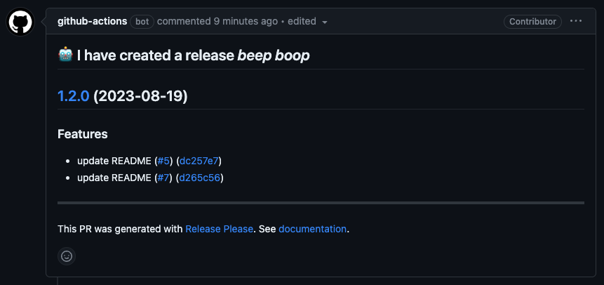
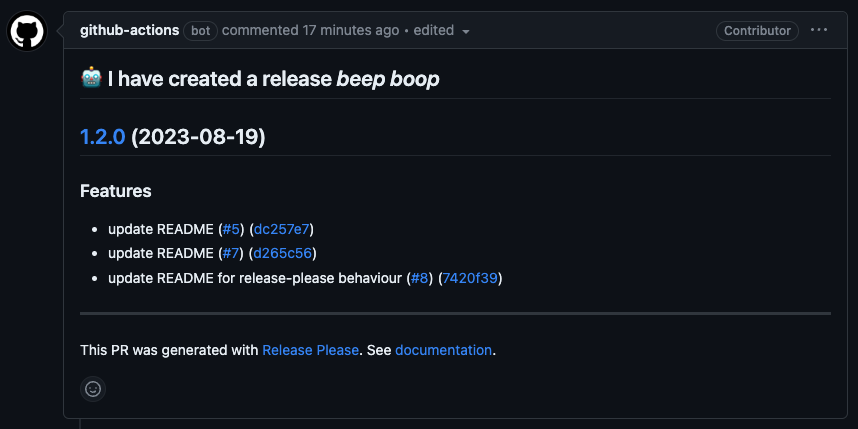
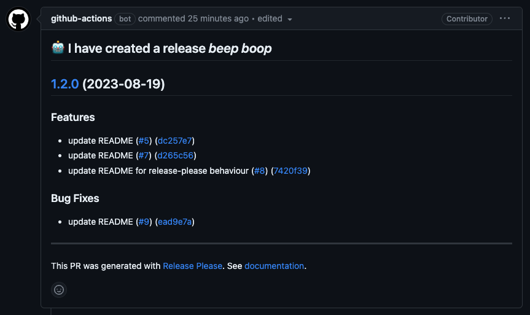

# `release-please` example

This repository is to survey [relase-please](https://github.com/googleapis/release-please), and take notes for the useage.

## GitHub Actions

You need to open `Settings` > `Actions` > `General` and check `Allow GitHub Actions to create and approve pull requests` in Workflow permissions if you get error as `release-please failed: GitHub Actions is not permitted to create or approve pull requests.`

### How to use

A release PR will be created when commit(s) that includes Conventional Commit messages is merged in target branch of GitHub Actions.

So, Linear git commit history (via squash-merge) is highly recommended by the maintainers.

#### Restrict only squash-merge

Go to `Settings` > `General` > `Pull Request`, then uncheck `Allow merge commits` and `Allow rebase merging` and change `Default to pull request title` for `Allow squash merging`.

[GitHub Apps](https://github.com/marketplace/semantic-prs) and [GitHub Actions](https://github.com/amannn/action-semantic-pull-request) would help you to make PR title semantic.

#### Restrict linear git commit history

Go to `Settings` > `Branches`, then add a branch protection rule.
Branch name pattern is `main` and check `Require linear history`.

You can protect from miss-pushing to a branch if you check `Require a pull request before merging`.

#### Follow the target branch's update

The release PR will be updated when a new commit is merged.
Following pictures are example of the above feature.

Bug-fix is also included in the minor version up.

#### Change the version number

a commit to the main branch has `Release-As: x.x.x` (case insensitive) in the commit body.

#### Pre-release feature

TBC

#### Create tag not only main branch

TBC

## Reference

- https://www.memory-lovers.blog/entry/2022/11/25/165938
